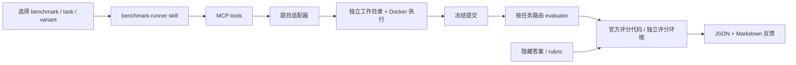

# GeneralAgentOS Benchmark Lab

一个独立安装的 benchmark 扩展：选择 benchmark、题目和 variant，准备输入文件，运行 agent，
提交后自动选择对应 evaluator，返回原生指标与反馈。GeneralAgentOS 只通过现有 `skill_list`
和 `mcp_list` 接入，无需修改 Agno/runtime。扩展也可以单独通过 CLI 使用。



## 已实现的范围

| Benchmark | 选择方式 | 自动评测 | 还需要准备什么 |
|---|---|---|---|
| DARE-Bench | 原始数据集 ID + `v1` / `v2`，公开版 324 个任务变体 | 上游 `evaluate_prediction`；保留分类、回归、预测的不同指标 | v1 分类/回归先在 solver 镜像生成本环境参考结果；其他公开评测数据随仓库提供 |
| CoDA-Bench | `instance_id`，公开版 1,009 题 | 上游 exact / numeric accuracy，只评当前选中题 | 对应 community 原始文件；完整资源约 43 GB，扩展不会自动全量下载 |
| DDR-Bench | `10k-6201` 等“场景-实体 ID”，291 个探索任务 | 上游 `UnifiedEvaluator` 的 message-wise / chat-wise checklist 指标 | 数据库、judge 模型和凭证；MIMIC / GLOBEM 需相应数据权限 |
| DAComp | `dacomp-001` / `dacomp-de-impl-001` 等 ID + `da` / `de-impl` / `de-evol` / `de-arch` | DA 官方多维 judge 与聚合；DE 官方 CFS 比较；Arch 官方 judge | 数据、DE gold、对应评测环境；DA/Arch 的上游模型配置 |
| Ambig-DS | Target 51 题 + Objective 61 题，每题两个条件 | Target 原始 DSBench `eval.py`；Objective 原始 MLE-bench `grade_csv` | 授权下载并按官方配方重建的输入、测试答案；Objective 需单独的 MLE-bench 环境 |

这不是五个 benchmark 已全部跑完的实验结果。它是可运行的选题、执行、评测接入层。
Task-level 官方 evaluator 不等于论文全套实验协议：DDR 当前使用统一探索指令；Ambig 当前覆盖
Target/Objective 的任务分数，尚不包含论文的 clarification oracle、ask-policy 与 framing 诊断。
正式报告实验时需固定提示、预算、环境，并接入相应协议。不要把不同 benchmark 的分数直接平均。

## 安装和最短路径

在 GeneralAgentOS 源码根目录执行，使用专门的 Python 环境：

```bash
python -m pip install -e '.[mcp]' -e './extensions/benchmarks[mcp]'
cd extensions/benchmarks
cp benchmarks.example.yaml benchmarks.yaml
python scripts/fetch_sources.py --benchmark dare-bench
docker build -f Dockerfile.sandbox -t gaos-bench-sandbox:latest .
```

扩展本身只依赖 PyYAML，MCP 是可选依赖。官方评测依赖单独安装；DARE evaluator 需要：

```bash
python -m pip install numpy pandas scikit-learn
gaos-bench --config benchmarks.yaml catalog
gaos-bench --config benchmarks.yaml tasks dare-bench --variant v2 --limit 10
gaos-bench --config benchmarks.yaml show dare-bench vishushekhar_pokemonunitedataset_class --variant v2
```

配置模型凭证后启动附带的独立 profile，端口为 `7788`：

```bash
export BENCH_PYTHON="$(command -v python)"
# 在当前目录 .env 或运行环境中设置 OPENAI_API_KEY；需要对外访问时也设置 GAOS_API_KEY。
gaos validate -p profile.yaml
gaos serve -p profile.yaml
```

对 `benchmark-agent` 发起**新会话**：

> 用 DARE-Bench 的 vishushekhar_pokemonunitedataset_class，variant=v2，测试一次并给我评测反馈。

也可问“列出可选 benchmark”“列出 CoDA-Bench 前 10 个题目”“查看某个 run 的结果”。
测试已有 agent 时，把 profile 中的模型、instructions 和它原本的任务技能换成待测配置，追加
benchmark MCP 工具。该技能负责运行流程，不提供解题技巧。不要同时连接能访问隐藏答案的主机文件工具。

如果要完全自动批量驱动、盲测 agent 或复现 Ambig 的问答协议，应在这个接入层之上增加独立
controller/solver runner。当前交互式 profile 的 solver 知道 benchmark 名称和 variant，适合调试，
不能声称是盲测。每次重试保留独立 run ID，并说明是否看过前一次测试反馈。

## 输入与输出

- DARE：按 `needed_files_v1/v2` 原样准备文件；输出 `prediction.csv`。
- CoDA：完整 community 在 `data/`；输出 `answer.txt`，遵守题目 answer guidelines。
- DDR：数据库在 `data/database.sqlite`，或 GLOBEM 目录在 `data/`；输出
  `insights.json`（非空字符串数组）和 `report.md`。隐藏 checklist 不给 agent。
- DAComp DA：输入在 `data/`；输出 `report.md`、`trajectory.txt` 和报告使用的图片。
- DAComp DE：在 `project/` 实现工程。提交时先在无 gold 的 Docker 环境执行 `project/run.py`，
  再由官方 CFS 比较代码读取生成数据库；评测进程不会执行 candidate Python。当前不支持 CS。
- DAComp Arch：输出 `architecture.yaml`。
- Ambig Target：在 `prepared/<task_id>/<variant>/` 只放该条件的公开输入。
  `gold/<task_id>/test_answer.csv` 单独保存。输出 `submission.csv`，列为 `id,prediction`，
  evaluator 在隐藏侧对齐测试 ID、恢复原始目标列名后调用 `eval.py`。
  遇到多标识列等特殊任务应使用定制 route，不能默默换指标。

每次运行保存于 `runs/<run_id>/`：

```text
workspace/              agent 可见目录；Docker 仅挂载这一项
execution/              每次 Python 调用和输出（operator 可见）
submission/             冻结提交
state.json              状态、题目版本、输入/提交 SHA-256、源码 revision
evaluation/             官方结果、隐藏评分上下文和日志（operator 可见）
feedback.json           对外反馈
feedback.md             可读报告
```

`submit_run` 返回后异步评分；`run_status` 取进度或结果。结果保留原生尺度。
缺输入是 `blocked`，产物格式不对是 `invalid_submission`，评分器崩溃/超时是 `evaluator_error`。
这些状态都不会伪造零分。缺产物时 run 仍可补交；已接受的提交不允许修改或重复计分。
当前是单用户研究环境，MCP 通过 stdio 连接；未提供多人权限、排队调度或服务级任务恢复。

## 官方数据和评测环境

`upstream.lock.json` 记录核对过的源码版本；`fetch_sources.py --benchmark all` 下载这些源码，
不覆盖已有 checkout，也不自动下载受限数据或 CoDA 的大型资源。升级上游后先运行 contract tests。

- [DARE](https://github.com/Snowflake-Labs/dare-bench)：v1 的 IF 环境敏感，执行
  `gaos-bench --config benchmarks.yaml prepare-reference <task_id>`，用 solver 镜像中的同一
  sklearn 环境生成参考预测并记录校验信息。不会用任意已有 CSV 冒充本环境参考。
- [CoDA](https://github.com/ruc-datalab/CoDA-Bench)：按官方 `scripts/setup_dataset.py` 准备数据，
  将 `communities` 指向包含 `community_XX/full_community` 的父目录。只测试少量题时可单独准备相关 community。
- [DDR](https://github.com/thinkwee/DDR_Bench)：准备对应数据库，并安装官方 evaluator 需要的
  pandas、requests、openai。`evaluators.ddr` 的 `provider/model/required_env` 控制评分服务。
- [DAComp](https://github.com/ByteDance-Seed/DAComp)：按官方 DA/DE README 下载数据，分别准备
  DA、DE、Arch 的依赖和模型配置。公开代码中的 endpoints 是占位符，填凭证本身并不足够。
- [Ambig Target](https://huggingface.co/datasets/anonymous222bit/Ambig-DS-T)：发布的是 prompts、配方和
  evaluators，比赛原始数据需按官方规则获取。不要将 `_manifest.json`、完整描述、rubrics 或 gold
  混入 ambiguous 输入目录。
- [Ambig Objective](https://huggingface.co/datasets/anonymous222bit/Ambig-DS-M)：设置 `objective_root`
  和 `mle_data`。用 MLE-bench（Python >= 3.11）准备任务数据；只复制 `prepared/public`。
  variant 为 `objective-full` / `objective-ambiguous`，提交保留原始 competition 列名。
  该 grader 的接口已按 MLE-bench `507f92e1138bb6e40dac5c6ee7a6758e6424bf97` 核对；
  尚未运行需要 Kaggle 数据的完整 Objective 评分。

不同 benchmark 可以各用一个 Python 环境：在 `evaluators.<route>.python` 写解释器绝对路径；
在该环境安装官方依赖即可，无需把这些依赖塞进 GeneralAgentOS 主环境。
`timeout_seconds`、`required_env` 和 `cwd` 都可按 route 配置。Judge 费用取决于所选模型和任务清单。

## 修改与扩展接口

| 要修改的内容 | 修改位置 |
|---|---|
| agent 怎么选择、执行、报告 | `skills/benchmark-runner/SKILL.md` |
| 某 benchmark 的题目字段、公开文件、输出要求 | `src/gaos_bench/adapters.py` |
| 调用哪套评分代码及转换格式 | `src/gaos_bench/worker.py` |
| 数据位置、judge、解释器、预算 | `benchmarks.yaml` |
| 状态、提交与运行记录 | `src/gaos_bench/engine.py` |
| 外部工具协议 | `src/gaos_bench/server.py` |

新增 benchmark 可写 adapter，也可先使用 JSONL manifest：

```json
{"task_id":"example-001","variant":"default","prompt":"Analyze the supplied data.","evaluator":"my-eval","artifacts":["answer.txt"],"inputs":[{"source":"datasets/example/input.csv","destination":"data/input.csv"}],"private":{"gold":"operator-only-reference"}}
```

```yaml
benchmarks:
  my-benchmark:
    adapter: manifest
    manifest: ./my-tasks.jsonl
    evaluators:
      my-eval:
        command: [/absolute/path/to/python, /absolute/path/to/wrapper.py, "{context}"]
        timeout_seconds: 600
```

wrapper 接收隐藏 context JSON：包含 task、private、submission 路径、output 路径。
它在 `output` 写以下结果，详细 gold/逐项评分另存 operator 日志；不可塞进反馈：

```json
{"status":"completed","metrics":{"accuracy":0.8},"feedback":["20% of submitted answers were incorrect."]}
```

失败时返回 `evaluator_error` 或 `invalid_submission`，`metrics` 必须为空。
command 使用参数数组执行，不经过 shell；只能由 operator 配置，agent 不能更换 evaluator。
Ambig 的额外实验协议可以用 `ambig-ds.manifest` 追加任务及独立 evaluator route。

## 测试

```bash
python -m pip install -e '.[mcp,test]'
pytest -q tests
```

默认测试不联网、不使用模型额度。设置 `GAOS_TEST_DARE_ROOT`、`GAOS_TEST_CODA_ROOT`、
`GAOS_TEST_DDR_ROOT`、`GAOS_TEST_DACOMP_ROOT`、`GAOS_TEST_AMBIG_ROOT` 可运行官方源码契约测试；
另设 `GAOS_TEST_DACOMP_DA_INDEX` 指向下载的 `dacomp-da.jsonl`，
`GAOS_TEST_OBJECTIVE_ROOT` 指向 Ambig-DS-M 源码。这些测试包括 DARE 真实数据
训练集常量基线的评分、CoDA 单题分母检查、隐藏信息隔离、variant 区分和失败状态。
CoDA 的格式测试使用测试输入目录，不是完整真实数据解题实验。
