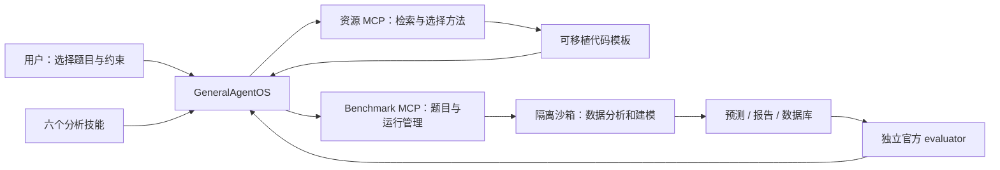

# Data Science Lab

给 GeneralAgentOS 增加可选择的数据科学方法、模型入口和资源检索。与
[Benchmark Lab](../benchmarks/README.md) 组合后，流程为：选题 → 选方法 → 在题目沙箱运行 → 提交 → 官方评价。
也可将本模块的 skills 与 MCP 接到其他具备沙箱执行器的 agent。

## 已交付什么

- **24 张资源卡**：模型、分析库、数据处理工具、Hugging Face/Kaggle，以及三个已有技能库。
- **6 个技能**：方法选择、表格建模、时间序列、统计与证据分析、文件发现与数据工程、资源研究。
- **10 个代码模板**：7 个已在合成数据上实际运行验证；3 个需要额外模型依赖，仅完成接口核对和代码编译检查。
- **5 个离线 MCP 工具 + 1 个可选在线搜索工具**。现有 AgentOS 核心无需修改。

完整来源和接入状态见 [资源说明](RESOURCE_GUIDE.md)。资源卡中的 benchmark 对应关系是我们的适用性判断，
不表示相关论文使用了这些模型，更不表示已测得性能提升。

## 结构与解耦



`resources.json` 管资源信息；`templates/` 管计算；`skills/` 管方法选择；`providers.py` 管在线平台；
`profile.yaml` 负责组合。资源服务不读取题目数据或私有答案，生成的代码不依赖本扩展包。
更换模型无需修改 evaluator；增加 benchmark 无需修改模型代码。

## 接入你的 Agent

以下命令在 GeneralAgentOS 仓库根目录、已激活的 Python 环境中运行：

```bash
python -m pip install '.[mcp]'
python -m pip install -e './extensions/benchmarks[mcp]'
python -m pip install -e './extensions/data-science[mcp]'
gaos validate -p extensions/data-science/profile.yaml
gaos serve -p extensions/data-science/profile.yaml
```

模型凭证和 benchmark 数据仍按 [Benchmark Lab 的配置步骤](../benchmarks/README.md) 准备。
`extensions/benchmarks/benchmarks.yaml` 必须存在，且须配置需要测的题目、数据路径和 evaluator。
只读资源检索不需要 Docker；在 benchmark 中执行代码需要其 Docker 沙箱。可先构建基础镜像：

```bash
docker build -t gaos-bench-sandbox:latest -f extensions/benchmarks/Dockerfile.sandbox extensions/benchmarks
```

已有自己的 profile 时，将 `extensions/data-science/skills` 加入 `skill_list`，再把
`python -m gaos_ds serve` 注册为 stdio MCP 即可；路径相对于你的 profile 所在目录。
`DS_PYTHON` 与 `BENCH_PYTHON` 可分别指向不同环境的 **绝对路径**，不用把全部依赖装进主 agent。

可以对 agent 说：

> 列出 DARE-Bench 的分类题，我选定题目后，先按题目要求建立基线，再给出官方评价。
>
> 这道题允许自由选模型。比较 scikit-learn 与 CatBoost，保持数据划分和预算一致。
>
> 先列出时间序列资源，按 CPU 环境推荐方法；模型不在当前环境时明确告诉我。
>
> 对选定的 DAComp 题检查文件和表结构，执行分析，把结论与计算证据对应起来。

## 工具接口

| 工具 | 用途 |
|---|---|
| `ds_search_resources(query, capability, limit)` | 检索固定资源库；支持中英文关键词 |
| `ds_get_resource(resource_id)` | 读取来源、依赖、用途、许可说明和模板 ID |
| `ds_recommend(capability, benchmark, gpu)` | 按公开任务类型和硬件给候选；不是性能排行榜 |
| `ds_list_recipes()` | 获取所有模板、参数 schema 和验证状态 |
| `ds_render_recipe(recipe_id, parameters)` | 生成独立代码、依赖检查代码和代码哈希 |
| `ds_search_hub(provider, kind, query, limit)` | 显式开启后，检索 HF/Kaggle 模型或数据集元数据 |

`capability` 可选：`classification`、`regression`、`forecasting`、`exploration`、`statistics`、
`explanation`、`causal`、`engineering`、`discovery`、`clustering`。

生成模板后，agent 将 `preflight_code` 和 `code` 分别交给原有 `execute_python`，输出文件会保留在当前题目工作区。
代码执行服务、数据科学资源服务、评分服务各自独立；资源 MCP 不在服务器主进程执行分析代码。

## 模板能力与边界

| 模板 ID | 行为 | 当前验证 |
|---|---|---|
| `profile-csv` | 类型、缺失、重复、数值范围 | 实际运行 |
| `sqlite-inspect` | 只读表结构和行数 | 实际运行 |
| `compare-groups` | 独立两组 Welch 检验、均值差、95% 区间 | 实际运行 |
| `tabular-sklearn` | 分类/回归；线性模型/随机森林；随机/时间/分组划分 | 实际运行 |
| `forecast-seasonal` | 多序列季节基线；按最后一个 horizon 回测 | 实际运行 |
| `tabular-catboost` | CatBoost，类别特征处理 | 实际运行；需要可选依赖 |
| `tabular-autogluon` | 限时 RF/XT 自动建模 | 可选模板，未实际训练 |
| `tabular-tabpfn` | 从明确指定的本地 checkpoint 建模 | 可选模板，未加载权重 |
| `forecast-statsforecast` | AutoARIMA，按时间回测 | 实际运行；需要可选依赖 |
| `forecast-chronos` | 本地 Chronos-2 单变量预测 | 可选模板，未加载权重 |

所有模板都返回运行记录，包括输入 SHA-256、参数、代码模板哈希、依赖版本；本地模型还记录权重文件哈希。
分类模板目前输出类别，回归输出点预测。需要概率、多目标、特殊特征处理时，按公开任务要求扩展模板。
通用输出不一定等于 benchmark 提交格式；技能会检查并转换列名、时间戳、ID 和行序后再提交。

可以用 `gaos-ds recipes` 查看完整参数。例如：

```bash
gaos-ds catalog --capability classification
gaos-ds resource tabpfn
gaos-ds render tabular-sklearn --parameters extensions/data-science/examples/tabular.json --code-only
```

[示例参数](examples/tabular.json) 中的文件名、目标和特征只是示例，需替换为当前题目的公开字段。

## 可选模型环境

CatBoost 和 StatsForecast 可以放入独立镜像：

```bash
docker build -t gaos-ds-cpu:0.1 -f extensions/data-science/Dockerfile.cpu extensions/data-science
```

然后将 benchmark 配置中的 `sandbox.image` 改为该镜像。这个 Dockerfile 尚未在当前机器构建，
因为当前没有 Docker。已运行的轻量模板测试来自本地合成夹具，不能算作 Docker 或完整模型评测。

AutoGluon、TabPFN、Chronos 应分别固定依赖与 checkpoint，预先准备在所选镜像中。
TabPFN 的 `model_path` 是文件路径；Chronos 的是完整模型目录，例如 `/models/chronos-2`。
模板禁止自动下载。模型权重的许可、访问条件和实际硬件要求见资源卡与上游。
默认 benchmark 执行器是 **CPU**；选择 `device=cuda` 不会自动开通 GPU。
需要 GPU 时，应在云端选择支持 GPU 的独立执行器或有针对性地扩展 sandbox 的设备配置。

AutoGluon 模板执行两次拟合，总预算应大于 `2 × time_limit`，还需留出预处理时间。
benchmark 的 `sandbox.max_seconds`、内存和执行工具 timeout 应按实际预算配置。

## Hugging Face / Kaggle 在线搜索

默认 profile 不暴露在线搜索工具。研究资源时，可在资源 MCP 的 args 中使用：

```yaml
args: [-m, gaos_ds, serve, --online]
```

或者单次显式查询：

```bash
gaos-ds search-hub huggingface models chronos --limit 5
gaos-ds search-hub huggingface datasets forecasting --limit 5
python -m pip install -e './extensions/data-science[kaggle]'
gaos-ds search-hub kaggle datasets 'time series' --limit 5
```

Kaggle 使用官方 CLI，仅允许 `datasets list` / `models list`；鉴权由操作者按官方文档配置。
没有凭证/依赖/网络时返回明确状态，不假装搜索成功。不会下载数据、读取 notebook、提交比赛或调用收费推理。
正式实验需提前确定外部资源政策；不要用在线检索寻找当前题目的答案或参考 notebook。

## 后续怎么改

1. **新增资源**：编辑 `src/gaos_ds/resources.json`，保留来源、checked_at 和准确接入状态。
2. **新增模型或分析方法**：添加 `templates/` 文件，在 `recipes.py` 注册参数、依赖和验证状态，再做一个有效行为测试。
3. **调整 agent 策略**：编辑对应 `skills/*/SKILL.md`，无需改 Python。
4. **新增平台**：只改 `providers.py` 和其测试；不要让其读取评分私有数据。
5. **更换 benchmark evaluator**：修改另一个扩展 `extensions/benchmarks`，本模块不用改。

外部完整 skill 库仅建立索引，未批量复制进 agent，避免一次载入大量与当前任务无关的工作流。
可以从资源卡选择具体 skill，再审阅并加入你自己的 `skill_list`。

## 验证

```bash
python -m pip install -e './extensions/data-science[mcp,test,cpu]'
pytest -q extensions/data-science/tests
ruff check extensions/data-science
python -m build extensions/data-science
```

测试涵盖真实模板执行、特征/划分隔离、类别和行序、时间频率、统计结果、只读数据库、参数转义、
资源搜索适配、MCP 通信与 AgentOS 的双 MCP / 七技能组合配置。
已实际验证的 CPU 环境为 Python 3.10、numpy 2.2.6、pandas 2.3.3、scikit-learn 1.7.2、SciPy 1.15.3、CatBoost 1.2.8、StatsForecast 2.0.2、Numba 0.61.2。
没有付费模型调用，没有声称这些方法改善了任何完整 benchmark 的分数。
